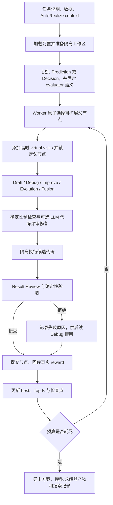

# AlgoEvolve

[](https://www.python.org/)
[](LICENSE)
[](https://fastapi.tiangolo.com/)

**不只搜索机器学习预测模型，也把部分决策优化与强化学习问题纳入同一套自动搜索、执行、评审和交付流程。**

AlgoEvolve 是一个面向预测与决策任务的自动机器学习方案搜索引擎。机器学习预测是当前最完整的核心能力；在此基础上，项目还部分支持数学优化、组合决策、启发式搜索、强化学习及其混合方案。它读取任务说明、数据和可选的 AutoRealize 结构化上下文，让多个闭环 Worker 在同一棵搜索树上生成、执行、评审并改进 Python 方案，最终导出最佳方案、Top-K 候选、可复用模型、策略或求解器产物，以及完整的可恢复搜索状态。

> [!IMPORTANT]
> AlgoEvolve 是 [InternScience/MLEvolve](https://github.com/InternScience/MLEvolve) 的大幅修改版，由 Bydecision 独立维护。不是 MLEvolve 官方发行版，不代表原 MLEvolve 团队对本项目的认可。上游版权、修改说明和许可证信息见 [NOTICE](NOTICE) 与 [LICENSE](LICENSE)。

## 能做什么

AlgoEvolve 的重点不是只让 LLM 写一份训练代码，而是让预测模型、优化算法和部分 RL 策略都能进入可验证、可比较、可恢复的搜索过程。

| 问题类型               | 当前定位             | 已接入的能力                                                                              |
| ---------------------- | -------------------- | ----------------------------------------------------------------------------------------- |
| **机器学习预测** | 核心支持             | 分类、回归、时序等任务的数据处理、验证、训练、推理、artifact 保存和 Top-K 比较            |
| **决策与优化**   | 部分支持             | 数学规划、组合优化、调度、分配、路径规划、启发式、局部搜索、元启发式及混合方法            |
| **强化学习**     | 部分支持、实验性更强 | 环境定义、策略训练、rollout、artifact 保存，以及和启发式或优化方法在统一 evaluator 下比较 |

“部分支持”表示这些任务已经进入正式工作流：它们可以生成专用方案、执行代码、接受 Result Review、参与搜索树评分，并通过 Decision/RL 接口导出。但是，决策与 RL 的可靠性更依赖任务是否提供明确的约束、状态转移、可行性校验器和统一评分函数；本项目并不宣称能够解决任意形式的决策或 RL 问题。

暂时只支持字面描述的决策问题或者使用环境内的gym，还不支持自由形式的环境或验证器参与搜索。

主要能力包括：

- **预测任务**：分类、回归、时序预测及其他从数据学习预测函数的任务。
- **部分决策任务**：数学优化、组合优化、调度、分配、路径规划和其他能够定义明确约束与 evaluator 的任务。Optimization 归入 Decision，而不是独立的问题类型。
- **部分强化学习任务**：当问题能够构造可信的 state、action、transition、reward 和终止条件时，可以训练并评估策略，尤其适用于部分序贯决策或可合理序贯化的静态优化任务。
- **开放方法空间**：模型可选择传统机器学习、深度学习、启发式、局部搜索、元启发式、数学规划、强化学习或混合方法，不受固定算法清单限制，也不会为了使用 RL 而强行把不合适的问题改造成 RL。
- **并行树搜索**：多个 Worker 并行选择不同父节点，每个 Worker 独立完成生成、执行、评审和提交。
- **可信结果评审**：结合完整代码、原始输出、指标、执行事实和任务约束，识别崩溃、分数绕过、空解、约束失效和不可信的极端指标。
- **稳定恢复**：保存 journal、UCT 统计、随机状态、Top-K 清单和在途动作；中断后可以在原搜索树上继续。
- **可复用交付**：最佳方案与 Top-K 方案使用有限的 Prediction、Decision 或 RL 接口，并附带机器可读的 `solution_manifest.json`。
- **服务化运行**：FastAPI 服务可启动、查询、停止任务，限制任务级 CPU、内存和加速器，并为前端提供搜索快照。

本项目会执行 LLM 生成的代码。请只在隔离环境中处理可信数据，并为任务设置合理的 CPU、内存、磁盘和时间限制。

## 系统工作流



### 1. 加载任务与准备工作区

系统按优先级合并默认 YAML、外部 YAML 和命令行点号覆盖参数。`data_dir` 必填，并且必须提供 `desc_file` 或内联 `goal`；仅使用 `goal` 时可用 `eval` 补充评估规则。

启动时会准备：

- `workspace/input`：供候选代码读取的输入数据；
- `workspace/working`：节点生成、执行和中间文件；
- `workspace/submission`：任务要求的提交产物；
- `logs`：journal、检查点、运行状态、模型调用用量和日志。

如果输入目录来自 AutoRealize，系统还会读取 `realize_report/automl_context.md`，使用其中的数据读取合同、字段语义、约束和 evaluator 定义。该文件是给模型的机器可执行说明，不替代真实数据或确定性校验器。

### 2. 识别问题族与评估方向

系统将任务归为两类：

- **Prediction**：学习 `data -> prediction`。
- **Decision**：生成满足约束的决策或求解结果；传统优化与 RL 都属于可选方法族。

指标必须在所有节点间保持同一语义、同一方向和同一计算公式。确定性规则会检查有限数值和指标方向，Result Review 则结合任务合同、代码与运行输出判断分数是否可信。若指标含糊不清，会导致LLM幻觉，进而导致搜不出合法方案。

### 3. 并行选择待扩展节点

每个空闲 Worker 从当前已提交的搜索树原子选择一个父节点。父节点同一时刻只能被一个 Worker 扩展；如果最高优先级节点已被占用，就尝试下一个可调度节点。

UCT 使用持久访问次数与临时 virtual visits：

```text
effective_visits = persistent_visits + virtual_visits

UCT = total_reward / effective_visits
    + C * sqrt(log(parent_effective_visits) / effective_visits)
```

- 未访问节点优先级为正无穷。
- 选择父节点后，系统立即沿祖先路径增加临时 virtual visits，让后来的 Worker 更倾向于其他分支。
- 临时访问只影响并发调度，不作为已完成搜索统计写入最终 UCT 状态；在途动作失败或被中断时会撤销。
- 节点评审结束后，系统移除临时访问并回传真实 reward。
- 探索常数 `C` 随搜索进度分段衰减。
- 搜索中后段会按时间进度把 UCT 探索与 Top-K 利用做软切换；Top-K 对单一根分支设配额，避免候选全部来自一条分支。

### 4. 生成候选方案

系统可产生以下节点：

- **Draft**：从根节点提出独立方案。
- **Debug**：读取失败代码、最新错误、评审原因和必要上下文，修复可执行性或逻辑缺陷。
- **Improve**：在可信父节点上提高指标、稳健性或交付完整性。
- **Evolution**：分支停滞时改变该分支的方法或关键假设。
- **Fusion Draft / Fusion**：在证据充分时转移多个分支的互补技术；要求重新整合，禁止直接拼接完整程序。

除快速首稿外，后续 Draft 通常使用 stepwise 生成：

| 问题族     | 阶段 1              | 阶段 2           | 阶段 3                   | 最终合并           |
| ---------- | ------------------- | ---------------- | ------------------------ | ------------------ |
| Prediction | Data & Validation   | Model & Training | Inference & Artifact     | MetaAgent 忠实合并 |
| Decision   | Problem & Evaluator | Decision Method  | Solve/Rollout & Artifact | MetaAgent 忠实合并 |

## 环境要求

- Conda、Miniconda 或 Miniforge；
- **Python 3.12**；
- 可访问的 OpenAI-compatible LLM API；
- 足够的 CPU、内存和磁盘空间；
- GPU、NPU 或其他加速器可选。

## 使用 Conda 安装

```bash
git clone https://github.com/DonaLdZY/AlgoEvolve.git
cd AlgoEvolve

conda create -n autodecision python=3.12 pip -y
conda activate autodecision
python -m pip install --upgrade pip
python -m pip install -r requirements.txt
```

`requirements.txt` 安装编排运行时和通用数据科学、深度学习、优化、RL 依赖。视觉、NLP、音频、地理、化学和其他较重领域依赖按需安装：

```bash
python -m pip install -r requirements_domain.txt
```

开发与测试依赖：

```bash
python -m pip install -r requirements-dev.txt
```

如果使用 GPU 版 PyTorch，请先按 [PyTorch 官方安装器](https://pytorch.org/get-started/locally/) 给出的、与你的 CUDA/ROCm/硬件匹配的命令安装，再安装项目其余依赖。本项目不固定某个 GPU 后端版本。

检查解释器和 PyTorch：

```bash
python -c "import sys, torch; print(sys.version); print(sys.executable); print(torch.__version__); print(torch.cuda.is_available())"
```

## 配置 LLM

不要把 API Key 提交到 YAML 或 Git。DeepSeek 的最小配置可以保留默认 `config/config.yaml` 中的 `/beta` 地址，只设置环境变量：

Windows PowerShell：

```powershell
$env:DEEPSEEK_API_KEY = "your-api-key"
```

Linux/macOS：

```bash
export DEEPSEEK_API_KEY="your-api-key"
```

也可以分别给生成、评审和 embedding 配置不同的 Key：

```text
ALGOEVOLVE_CODE_API_KEY
ALGOEVOLVE_FEEDBACK_API_KEY
ALGOEVOLVE_EMBEDDING_API_KEY
```

API Key 优先级：

1. YAML、CLI 覆盖或服务请求中的非空 `api_key`；
2. `ALGOEVOLVE_CODE_API_KEY` / `ALGOEVOLVE_FEEDBACK_API_KEY`；
3. `DEEPSEEK_API_KEY`。

Embedding Key 优先读取配置，其次是 `ALGOEVOLVE_EMBEDDING_API_KEY` 和 `EMBEDDING_API_KEY`。为了让既有部署平滑迁移，旧 `MLEVOLVE_*` 环境变量仍作为低优先级兼容别名。最终解析配置与检查点会清除明文 Key。

其他 OpenAI-compatible provider 可以覆盖 `agent.code.model`、`agent.code.base_url`、`agent.feedback.model` 和 `agent.feedback.base_url`。仅当后端实际兼容时才使用 DeepSeek 专有的 prefix completion 或 thinking 能力。

## 准备输入

推荐目录：

```text
task-input/
|-- description.md
|-- <data files>
`-- realize_report/
    `-- automl_context.md   # 可选，通常由 AutoRealize 生成
```

`description.md` 至少应明确：

- 目标与业务语义；
- 输入文件、表、sheet、列和类型；
- 训练/验证边界，或决策变量与约束；
- 唯一的 evaluator 公式和越大/越小越好；
- 输出格式与允许使用的数据。

如果不提供 `description.md`，可通过 `goal="..."` 和 `eval="..."` 直接运行，但复杂任务更适合使用文件化说明。

## 命令行运行

查看参数说明：

```bash
python run.py --help
```

Windows PowerShell 示例：

```powershell
python .\run.py `
  data_dir="D:\runs\demo\autorealize" `
  desc_file="D:\runs\demo\autorealize\description.md" `
  exp_id="demo" `
  exp_name="demo" `
  log_dir=".\runs" `
  workspace_dir=".\runs" `
  agent.steps=50 `
  agent.time_limit=10800 `
  agent.search.parallel_search_num=4 `
  agent.output_language="chinese"
```

Linux/macOS 示例：

```bash
python run.py \
  data_dir=/data/demo/autorealize \
  desc_file=/data/demo/autorealize/description.md \
  exp_id=demo \
  exp_name=demo \
  log_dir=./runs \
  workspace_dir=./runs \
  agent.steps=50 \
  agent.time_limit=10800 \
  agent.search.parallel_search_num=4 \
  agent.output_language=english
```

当 `log_dir` 与 `workspace_dir` 指向同一根目录，新任务会写入：

```text
runs/<YYYYMMDD_HHMMSS>_<exp_name>/
|-- logs/
`-- workspace/
```

### 外部配置文件

默认配置为 [`config/config.yaml`](config/config.yaml)。可用环境变量指定另一份 YAML：

PowerShell：

```powershell
$env:ALGOEVOLVE_CONFIG_PATH = "D:\configs\my-algoevolve.yaml"
python .\run.py data_dir="D:\data" desc_file="D:\data\description.md"
```

Bash：

```bash
ALGOEVOLVE_CONFIG_PATH=/configs/my-algoevolve.yaml \
python run.py data_dir=/data desc_file=/data/description.md
```

配置优先级从低到高：

```text
config/config.yaml
< ALGOEVOLVE_CONFIG_PATH 指向的 YAML
< run.py 的 key=value 点号覆盖
< service 生成的任务级覆盖
```

## 关键配置

完整配置及中英注释见 [`config/config.yaml`](config/config.yaml)。下列项目对耗时、成本和搜索行为影响最大：

| 配置                                        |        默认值 | 作用                                             |
| ------------------------------------------- | ------------: | ------------------------------------------------ |
| `agent.steps`                             |        `50` | 最多提交的搜索节点数                             |
| `agent.time_limit`                        |     `10800` | 整体搜索时限，秒                                 |
| `agent.initial_drafts`                    |         `3` | 正常 UCT 搜索前强制完成的根草稿数                |
| `agent.search.parallel_search_num`        |         `4` | 并行闭环 Worker 数；同时影响 LLM、CPU 和内存压力 |
| `agent.search.num_drafts`                 |         `8` | 根节点允许的最大 Draft 子节点数                  |
| `agent.search.num_bugs`                   |         `1` | 单个 buggy 节点的最大 Debug 子节点数             |
| `agent.search.num_improves`               |         `5` | 普通成功节点的最大 Improve 子节点数              |
| `agent.search.root_new_draft_probability` |      `0.25` | 初始草稿后继续创建根分支的概率                   |
| `agent.search.explore_switch_start/end`   | `0.5 / 0.7` | UCT 向 Top-K 利用软切换的时间进度区间            |
| `exec.timeout`                            |      `1800` | 单节点执行超时，秒                               |
| `resources.cpu_cores`                     |         `4` | 整个任务进程树共享的逻辑 CPU 配额                |
| `resources.memory_limit_gb`               |       `8.0` | 整个任务进程树共享的内存目标；`0` 表示不限     |
| `agent.output_language`                   |   `english` | 模型生成内容语言：`english` 或 `chinese`     |
| `agent.draft.stepwise_context_max_tokens` |     `90000` | 触发较早动态上下文压缩的估算输入预算             |
| `runtime.resume_budget_mode`              |     `total` | 恢复时预算按累计总量或新增量解释                 |

`agent.code` 与 `agent.feedback` 分别配置生成模型和评审模型，包括 model、base URL、temperature、thinking、reasoning effort、输出上限、超时和网络重试。网络重试与角色级审查次数是不同概念，避免同时调高造成意外成本。

## 继续已有搜索

直接 CLI 恢复时，`log_dir` 和 `workspace_dir` 必须指向上次运行实际使用的两个目录，而不是它们的共同父目录：

```powershell
python .\run.py `
  runtime.resume_run=true `
  runtime.resume_budget_mode="additional" `
  log_dir="D:\runs\20260727_120000_demo\logs" `
  workspace_dir="D:\runs\20260727_120000_demo\workspace" `
  data_dir="D:\runs\demo\autorealize" `
  desc_file="D:\runs\demo\autorealize\description.md" `
  agent.steps=20 `
  agent.time_limit=3600
```

- `total`：`agent.steps` 和 `agent.time_limit` 是包含既有工作在内的最终总预算。
- `additional`：本次设置的步数和时间追加到已完成工作之上。

也可设置 `ALGOEVOLVE_RESUME_RUN=1`。旧 `MLEVOLVE_RESUME_RUN` 仍兼容。恢复会沿用持久搜索统计和产物，但不会恢复已退出 Python 进程的堆内存、模型实例或临时缓存。

## FastAPI 服务

启动服务：

```bash
python -m uvicorn service_api:app --host 127.0.0.1 --port 18103
```

打开 [http://127.0.0.1:18103/docs](http://127.0.0.1:18103/docs) 查看 OpenAPI。主要端点：

| 方法     | 路径                     | 作用                       |
| -------- | ------------------------ | -------------------------- |
| `GET`  | `/health`              | 健康检查                   |
| `GET`  | `/resources/inventory` | 探测 CPU、内存和加速器     |
| `POST` | `/jobs/start`          | 启动独立搜索进程           |
| `GET`  | `/jobs/{job_id}`       | 查询状态、资源和日志尾部   |
| `POST` | `/jobs/stop`           | 触发可恢复中断并停止进程树 |
| `POST` | `/snapshot`            | 读取前端所需的搜索快照     |

PowerShell 启动任务：

```powershell
$body = @{
  task_id = "demo"
  python_executable = (Get-Command python).Source
  working_dir = (Get-Location).Path
  config_path = ""
  args = @(
    "data_dir=D:\runs\demo\autorealize",
    "desc_file=D:\runs\demo\autorealize\description.md",
    "exp_name=demo",
    "agent.steps=50",
    "agent.time_limit=10800",
    "agent.search.parallel_search_num=4"
  )
  log_dir = "D:\runs"
  workspace_dir = "D:\runs"
  resume = $false
  resources = @{
    cpu_cores = 4
    memory_limit_gb = 8.0
    accelerator_mode = "selected"
    accelerator_device_ids = @("cuda:0")
    monitor_interval_seconds = 0.5
  }
} | ConvertTo-Json -Depth 6

$job = Invoke-RestMethod `
  -Method Post `
  -Uri "http://127.0.0.1:18103/jobs/start" `
  -ContentType "application/json" `
  -Body $body

$job
```

查询、停止和获取快照：

```powershell
$status = Invoke-RestMethod "http://127.0.0.1:18103/jobs/$($job.job_id)"

Invoke-RestMethod `
  -Method Post `
  -Uri "http://127.0.0.1:18103/jobs/stop" `
  -ContentType "application/json" `
  -Body (@{ job_id = $job.job_id } | ConvertTo-Json)

Invoke-RestMethod `
  -Method Post `
  -Uri "http://127.0.0.1:18103/snapshot" `
  -ContentType "application/json" `
  -Body (@{
    log_dir = $job.log_dir
    workspace_dir = $job.workspace_dir
  } | ConvertTo-Json)
```

同一 `task_id` 不能同时启动两个活动任务。停止接口先请求任务写出最小可恢复检查点，检查点 manifest 落盘后再终止整个进程树。服务返回的 `interrupted_resumable` 表示可继续，`interrupted_incomplete` 表示检查点不完整。

## 输出目录

常见日志文件：

```text
logs/
|-- journal.json
|-- filtered_journal.json
|-- run_status.json
|-- pending_nodes.json
|-- checkpoint_manifest.json
|-- config.yaml
|-- best_solution.py
|-- AlgoEvolve.log
|-- AlgoEvolve.verbose.log
|-- llm_usage.jsonl
|-- llm_usage_summary.json
|-- llm_usage_brief.json
|-- dependency_installations.jsonl
|-- dependency_installations_summary.json
`-- resource_usage.json
```

常见工作区：

```text
workspace/
|-- input/
|-- working/
|-- submission/
|-- best_solution/
|   |-- solution.py
|   |-- metric.txt
|   |-- node_id.txt
|   |-- solution_manifest.json
|   `-- <model-or-solver-artifacts>
`-- top_solution/
    |-- top1/
    |-- top2/
    `-- ...
```

`llm_usage.jsonl` 记录每次调用的输入、输出、reasoning 和缓存 token；summary 按模型、阶段和调用类型汇总，便于分析成本。自动补库记录精确缺失模块、安装命令、解释器、耗时、结果和 pip 输出尾部。

## 生成方案接口

详细合同见 [`docs/solution_interface.md`](docs/solution_interface.md)。每个 best/Top-K 目录都应包含 `solution_manifest.json`，其中记录 `interface_version: algoevolve.solution.v1`、任务种类、是否有状态、artifact 路径、方法族和入口函数。恢复逻辑仍接受旧 `mlevolve.solution.v1` 产物。

Prediction：

```python
def train(data, artifact_dir): ...
def predict(model_path, data): ...
```

Decision solver：

```python
def solve(model_path, data): ...
```

RL 或 hybrid Decision：

```python
def train_policy(data, artifact_dir): ...
def rollout(model_path, data): ...
```

`predict` 和 `rollout` 必须加载已有 artifact，不得偷偷重新训练。无状态启发式或数学求解器可以接受 `model_path=None`，但输出仍必须经过任务的确定性 validator 与 scorer。

## 缺失依赖自动安装

当 `exec.auto_install_missing_dependencies=true` 时，候选代码可以声明安全的 import-to-package 绑定，例如：

```python
# ALGOEVOLVE_PIP_INSTALL[sklearn]: pip install scikit-learn
```

只有执行出现精确 `ModuleNotFoundError` 后，系统才会将包安装到当前任务隔离目录并立即重跑同一节点。生成代码直接执行 pip、conda 或 shell 安装仍会被拒绝。严格部署可以把 `exec.dependency_install_policy` 改为 `allowlist`。

## 上游项目申明

本仓库基于原版 [MLEvolve](https://github.com/InternScience/MLEvolve) 修改。上游项目页与论文：

- [MLEvolve 项目页](https://internscience.github.io/MLEvolve/)
- [MLEvolve: A Self-Evolving Framework for Automated Machine Learning Algorithm Discovery](https://arxiv.org/abs/2606.06473)
- [AutoMLGen: Navigating Fine-Grained Optimization for Coding Agents](https://arxiv.org/abs/2510.08511)
- [InternAgent 1.5](https://arxiv.org/abs/2602.08990)

AlgoEvolve 相对上游的主要修改包括：

- 原子父节点选择、临时 virtual visits、父节点单扩展锁和并行闭环 Worker；
- 可恢复的搜索运行态、在途动作、随机状态、journal 快照和中断检查点；
- Prediction/Decision 问题分类，以及 ML、优化、RL 和混合方法的正交选择；
- 渐进 Draft、Evolution、证据驱动 Fusion 和优化经验检索；
- 生成后预检查、代码 Reviewer 修复、Result Review 与异常结果二次裁决；
- 有限的生成方案接口和 `solution_manifest.json`；
- provider-friendly 累积上下文、headroom 压缩、精确快照取回和统一输出语言；
- DeepSeek `/beta`、prefix completion、thinking/reasoning 与用量统计；
- AutoRealize 上下文接入、FastAPI 服务、任务级资源限制和扩展测试。

## 许可证与商标

代码按 [Apache License 2.0](LICENSE) 发布。`LICENSE` 同时保留原 MLEvolve 的版权声明，并加入 Bydecision 的修改版权。分发源码或衍生版本时，应继续：

1. 附带完整 Apache-2.0 许可证；
2. 保留适用的版权、专利、商标和归属声明；
3. 保留 [NOTICE](NOTICE)；
4. 在你修改过的文件中醒目标注变更；
5. 不暗示上游作者或机构对衍生版本背书。

Apache-2.0 第 6 条不授予商号、商标、服务标志或产品名称的使用权，仅允许为说明作品来源所必需的合理使用。AlgoEvolve 不使用上游 logo 作为自己的品牌；若要把上游名称或 logo 用于宣传、产品标识或组织标识，请先获得相应权利人的许可。

本节是面向开源发布的实践说明，不构成法律意见。对公司发布、商标注册或商业分发有疑问时，请咨询合格法律顾问。

## 引用上游工作

如果研究或产品使用了 AlgoEvolve，请同时注明本派生仓库并按上游要求引用原 MLEvolve：

```bibtex
@article{du2026mlevolve,
  title={MLEvolve: A Self-Evolving Framework for Automated Machine Learning Algorithm Discovery},
  author={Du, Shangheng and Yan, Xiangchao and Shi, Jinxin and Cao, Zongsheng and Feng, Shiyang and Liang, Zichen and Sun, Boyuan and Peng, Tianshuo and Zhou, Yifan and Li, Xin and Zhou, Jie and He, Liang and Zhang, Bo and Bai, Lei},
  journal={arXiv preprint arXiv:2606.06473},
  year={2026}
}
```
